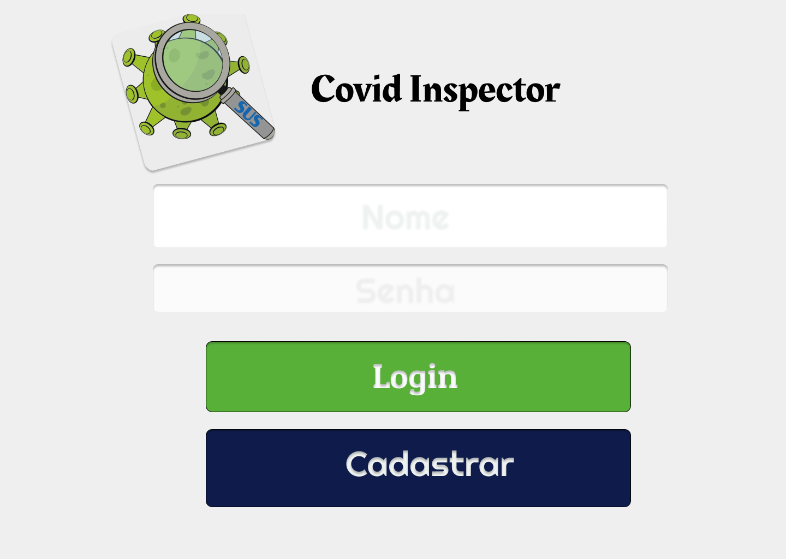
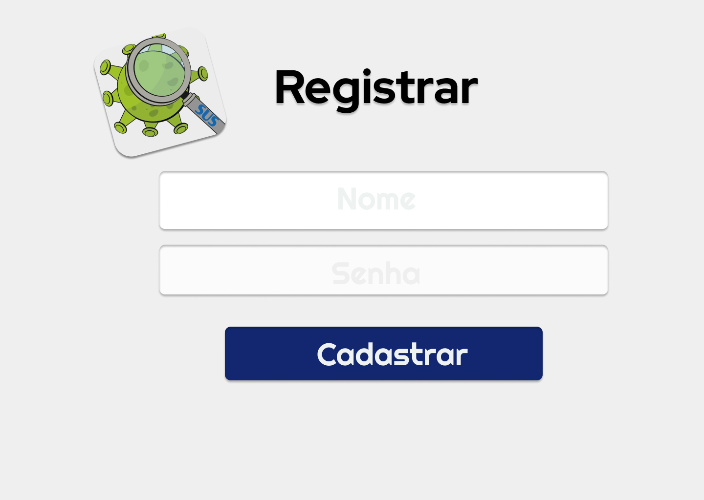
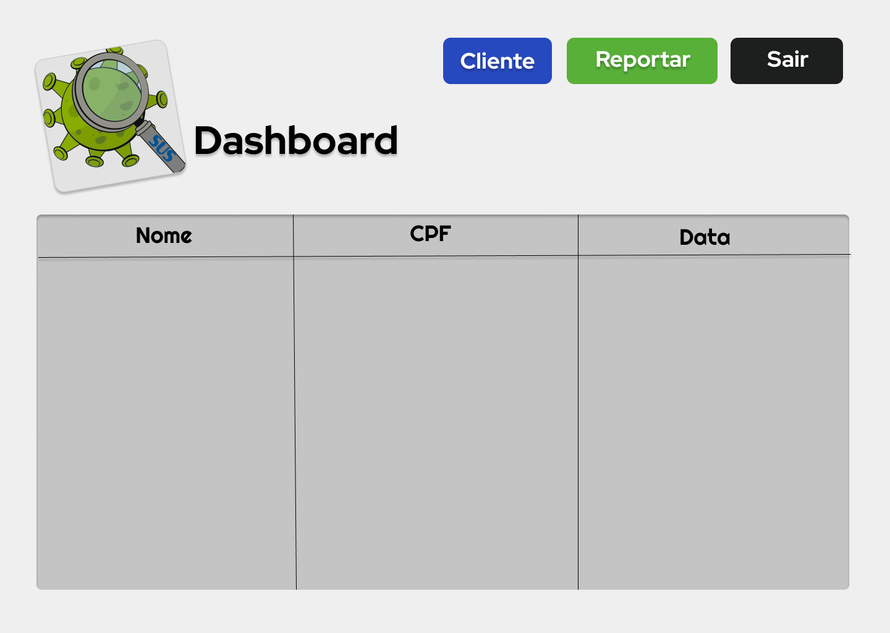
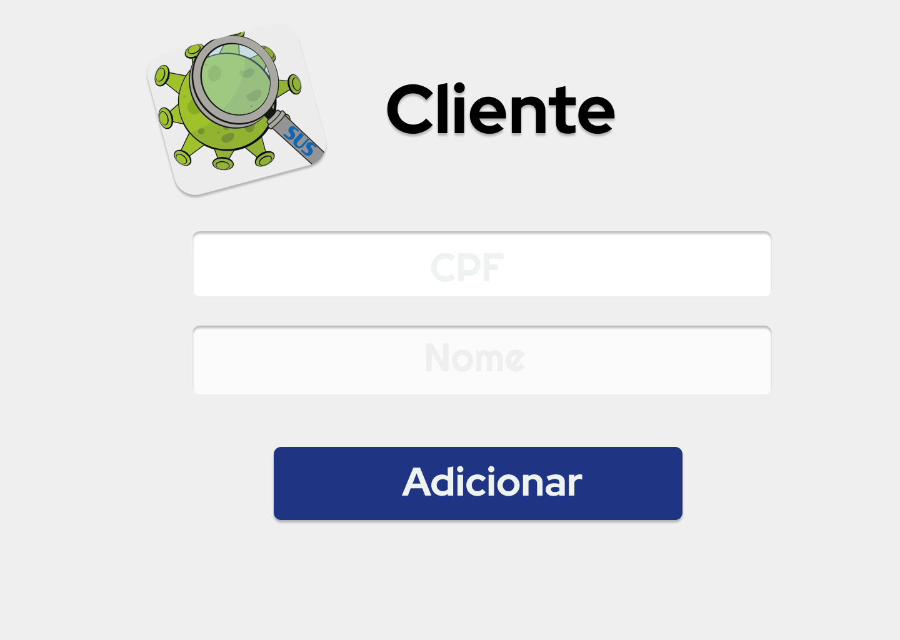
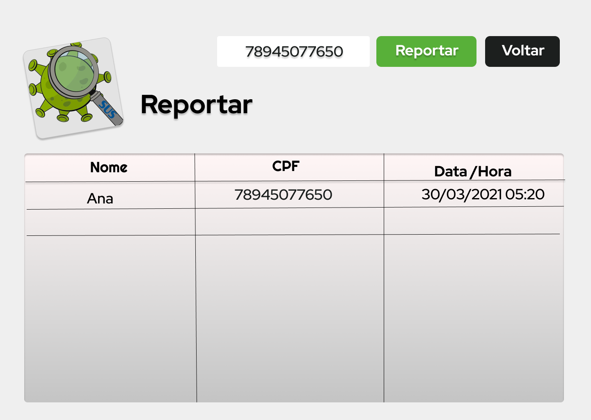

# Design
Antes do desenvolvimento da aplicação e com os requisitos definidos foram idealizadas as telas, que foram utilizadas como base para o desenvolvimento do frontend e tambem para organizar melhor quais as repostas da API, sabendo quais informações as paginas necessitariam.

O design foi feito utilizando a ferramenta figma e o projeto pode ser acessado [aqui](https://www.figma.com/file/v435ybxhNSZtaosY9O4DJ9)

## Login

  

## Cadastrar

  

## Dashboard / Tela Principal

  

## Adicionar cliente

  

## Reportar Cliente

  

